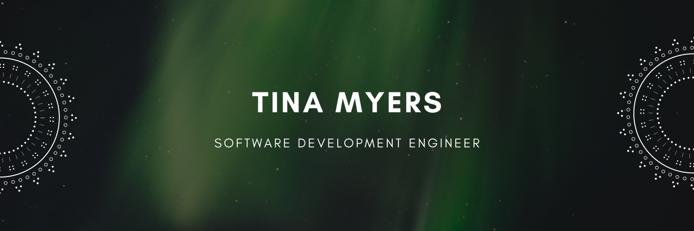
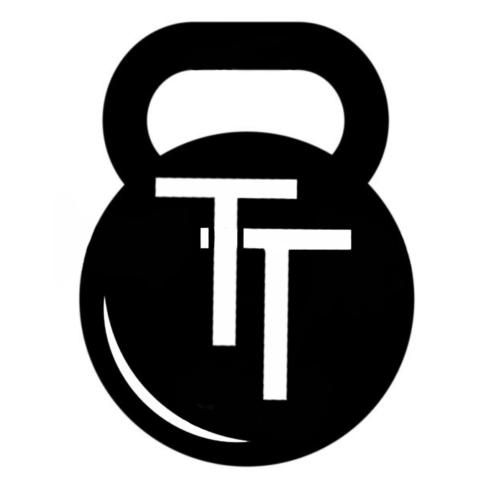

# Tedashi Trained

Tedashi Trained is the production website for Forever Body Fitness, a personal training business. The application includes a React front end and a corresponding back-end API, with the API live [here](https://tt-api-server.herokuapp.com/) and its GitHub repository [here](https://github.com/myerstina515/APIserver).

The application has recently expanded to include a blog and content-management system powered by [Sanity](https://www.sanity.io/). Sanity allows the business owner to independently create and manage content while preserving the existing custom application architecture. More information about the decision to integrate Sanity and the implementation can be found below.

The deployed front-end application lives [here on Heroku](https://tedashi-trained.herokuapp.com/).

## Created by: Tina Myers

## Sanity Content Platform Integration

The owner came to me with a business plan for increasing his web presence and scaling the business. A key part of that plan was publishing educational content regularly, but the existing website had been built as a custom React application and required developer involvement to make content changes.

Rather than rebuilding the site around a traditional CMS or creating a custom content-management system, I evaluated options that would preserve the existing application while giving the owner direct control over his content. I selected Sanity because its structured-content approach fit the existing React architecture while providing the flexibility to build an editing experience around the needs of the business.

The initial implementation adds a Sanity-managed blog with structured posts and categories, Portable Text content, image management, category filtering, and configurable featured posts. The content model and editorial controls are designed so the owner can manage publishing independently while the application controls how that content is presented to visitors.

The integration also creates a foundation for expanding content management beyond the blog. Future iterations could move additional business content into Sanity, including services and other frequently updated website information, allowing the site to evolve without requiring code changes for routine content updates.

This project is continuing to evolve alongside the business. The goal isn't simply to add a blog—it is to create a maintainable content architecture that gives the business owner greater control today while leaving room for new content experiences and functionality as the business grows.

### Contact me

[email](mailto:myers.tina515@gmail.com)👩‍💻

[LinkedIn](https://www.linkedin.com/in/tinalmyers/)💻

[GitHub](https://github.com/myerstina515)

#### License

[MIT](https://choosealicense.com/licenses/mit/)

## Build History & Troubleshooting
<!-- - [Stable React 18 / MUI v4 Build Logic](https://www.google.com/search?q=why+does+my+macbook+not+have+the+option+of+upgrading+to+tahoe&rlz=1C5CHFA_enUS917US920&oq=why+does+my+macbook+not+have+the+option+of+upgrading+to+tahoe&gs_lcrp=EgZjaHJvbWUyBggAEEUYOdIBCTE3MDk1ajBqN6gCALACAA&sourceid=chrome&ie=UTF-8)
 -->
